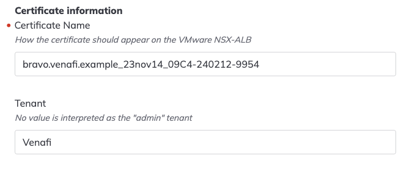
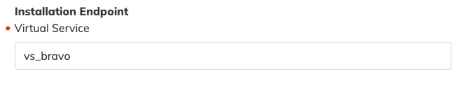

[](https://www.venafi.com/)
[](https://opensource.org/licenses/MPL-2.0)

# vmware-avi-connector
Sample TLSPC machine connector 


# Dependencies
Below are the minimal dependency version that are required to build ....
- GNU Make 3.81
- jq - commandline JSON processor [version 1.6]
- go version go1.20
- Docker version 24.0.7
- golangci-lint has version 1.52.2


# Setting up environment variables
To build an image that will be run within a Venafi Satellite for provision and/or discovery operations you will need to define a CONTAINER_REGISTRY environment variable.

```bash
export CONTAINER_REGISTRY=company.jfrog.io/connectors/vmware
```

> **_NOTE:_** The image, push and manifests make targets will fail if no CONTAINER_REGISTRY value is set. 

> **_NOTE:_** Venafi developer documentation is available at ? 


# Venafi Satellite
A Venafi Satellite is a customer hosted infrastructure component designed to provide certain functionality within the customers network such as private network discovery and integrations among other services.  The Venafi Satellite provides private services within a customer's network by making communications from the the customer network to Venafi as a Service, requiring only outbound communication and connectivity to managed endpoints.

To support integrations with other systems, such as a VMware NSX Advanced Load Balancer, developers can create a machine connector to perform predefined functions.   A machine connector is a plugin that acts as a middleware to communicate between the Venafi Platform to any 3rd party applications. The connector is responsible for authenticating, pushing, and configuring the certificate from Venafi to any application of the developer's choice.

In the Venafi world, every connector is a REST-based web service with certain predefined APIs implemented to perform a specific provisioning or discovery task. A machine connector is composed of three parts.
- An executable that is run within a container.  The executable uses a web framework to receive incoming requests from a service within the Venafi Satellite.  The request is processed and the response is returned to the internal service which then sends the result to VaaS.
- A manifest that defines a series of data structures that are used during different operations.
  - The manifest MUST define the properties required for connecting to the target as well as the properties for storing a certificate, private key and the issuing certificate chain (e.g. the keystore properties).
  - The manifest can optionally define the properties needed to reconfigure the target to use the newly installed certificate, such as restarting a service (e.g. the binding properties).
- A container image that is compatible with the executable.  It is strongly recommended that the image also contain the manifest.json so that if a change to the manifest is made, but not to the executable code, then the container image SHA256 digest will also be changed.

Additional resources for developing a machine connector are available at [Venafi Dev Central](https://developer.venafi.com/tlsprotectcloud/docs/libraries-and-sdks-connector-framework)


# Provisioning Connector Basics
A machine connector must always support provisioning a certificate, private key and the issuing certificate chain to a target such as a VMware NSX Advanced Load Balancer (Avi).

## Manifest
The manifest.json file contains the definitions for connection, provisioning and discovery operations.  These definitions are also used in the Venafi as a Service UI for using the machine connector.
As data is exchanged with the machine connector that data is validated against the manifest.json file.  The only field names and values permitted are those defined within the file.  For example, if the connection JSON node defines a username and a password property then only those field names and values are sent to the machine connector as part of the connection data.  Additionally, only field names and values defined in the keystore node are permitted as a response to a discovery operation.

The manifest is a JSON document with a defined structure and required nodes.  The top level node must the following fields:
- ___name___: the required name of the machine connector such as "VMware NSX Advanced Load Balancer (AVI)".  This value is shown in the Venafi as a Service UI.
- ___pluginType___: a required field for a machine connector and the value must be "MACHINE"
- ___workTypes___: a required collection of strings indicating the capabilities of the machine connector.  All machine connectors are required to support provisioning operations and must have a value of "PROVISIONING" in the collection.  Optionally, if the machine connector supports discovery then the value "DISCOVERY" should also be included.

Additionally the top level node should contain the following:
- ___deployment___: a required node that contains the image location that will be used by the Venafi Satellite to pull the container.
    - ___executionTarget___: a required field the value "vsat".
    - ___image___: the required container registry and image path used to pull the container image.
- ___domainSchema___: a required node that contains definitions for connection, provisioning and discovery operations.

## User Interface
The Venafi as a Service user interface for a machine connector is dynamically rendered using the definitions within the manifest.  The property definitions in the domainSchema node are evaluated as the user interface is rendered.  Property labels and descriptions are mapped from the property definition using the x-labelLocalizationKey field where the value contains a dotted path to within a language in the localizationResources node. 

- ___localizationResources___: a required top level node containing the text shown in the Venafi as a Service UI.
  - ___en___: a required node containing the English language localization values.  The definitions contained within this node are mapped to the x-labelLocalizationKey fields defined on properties in the manifest.
    - ___address___: a node containing the localization fields for properties having an x-labelLocalizationKey values beginning with address.
      - ___label___: the value for properties having an x-labelLocalizationKey value of "address.label".

## Routes
All machine connectors must support provisioning operations.  These operations include testing access to the device host (e.g. testConnection), installing a certificate, private key and the issuing certificate chain (e.g. installCertificateBundle) and configuring usage of an installed certificate (e.g. configureInstallationEndpoint).

If a machine connector supports discovery operations then a definition for performing a discovery is also required (e.g. discoverCertificates).

- ___hooks___: a required top level node containing the mapping and requestConverters nodes.
  - ___mapping___: a required node defining the operations and the corresponding REST URL path.  Each of the required sub-nodes _MUST HAVE_ a path definition containing the REST URL path to be used to execute the corresponding operation.
    - _configureInstallationEndpoint_: a required node for configuring an installation endpoint operation.
    - _installCertificateBundle_: a required node for installing a certificate, private key and issuing certificate chain.
    - _testConnection_: a required node for test connection.
    - _discoverCertificates_: a required node if the connector supports the DISCOVERY work type.
    - _getTargetConfiguration_: an optional node for an unused operation.
  - ___requestConverters___: a required array of named converters.  If any manifest property has an x-encrypted field with a value of true then the collection must contain the value of "arguments-decrypter". 

## Responses
The response for a machine connector operation, such as testConnection, must be an HTTP status code:
- between 200 (OK) and 299, inclusive, indicating a successful operation; or,
- between 400 (Bad Request) and 499, inclusive, indicating a failed operation.

> **_NOTE_**: Venafi reserves the usage of HTTP 5xx status codes to indicate a failure within the Venafi Satellite logic.

The response body for a failed operation should be a simple error message string that is shown to the user and logged by Venafi as a Service.

## Testing Access
The data required to test connectivity with a device host can be defined in the connection node of the domainSchema node.  These fields can include hostname / IP address, port, username and password for example.

- ___connection___: a node within the domainSchema node that defines the properties needed to perform a connection test with the device host.
  - _properties_: a collection of nodes defining the property values needed to perform a connection to the device host.
  - _required_: an optional collection of property names indicating that a value is required for the corresponding property.
  - _type_: a required field which has a value of "object".

In this sample machine connector the connection definition is:
```json
  "connection": {
    "allOf": [
      {
        "if": {
          "properties": {
            "credentialType": {
              "const": "local"
            }
          },
          "required": [
            "credentialType"
          ]
        },
        "then": {
          "required": [
            "credentialType",
            "username",
            "password"
          ]
        }
      },
      {
        "if": {
          "properties": {
            "credentialType": {
              "const": "shared"
            }
          },
          "required": [
            "credentialType"
          ]
        },
        "then": {
          "required": [
            "credentialType",
            "credentialId"
          ]
        }
      }
    ],
    "properties": {
      "credentialId": {
        "description": "credentialId.description",
        "type": "string",
        "x-credential": {
          "authType": "username_password",
          "value": "#/properties/credentialId",
          "mapping": {
            "username": "#/username",
            "password": "#/password"
          }
        },
        "x-labelLocalizationKey": "credentialId.label",
        "x-rank": 3,
        "x-rule": {
          "effect": "SHOW",
          "condition": {
            "scope": "#/properties/credentialType",
            "schema": {
              "const": "shared"
            }
          }
        }
      },
      "credentialType": {
        "default": "local",
        "description": "credentialType.description",
        "oneOf": [
          {
            "const": "local",
            "title": "credentialType.local"
          },
          {
            "const": "shared",
            "title": "credentialType.shared"
          }
        ],
        "x-featureKey": "credential_manager_cyberark",
        "x-labelLocalizationKey": "credentialType.label",
        "x-rank": 2
      },
      "hostnameOrAddress": {
        "type": "string",
        "x-labelLocalizationKey": "address.label",
        "x-rank": 0
      },
      "password": {
        "type": "string",
        "x-controlOptions": {
          "password": true,
          "showPasswordLabel": "password.showPassword",
          "hidePasswordLabel": "password.hidePassword"
        },
        "x-encrypted": true,
        "x-labelLocalizationKey": "password.label",
        "x-rank": 4,
        "x-rule": {
          "effect": "SHOW",
          "condition": {
            "scope": "#/properties/credentialType",
            "schema": {
              "const": "local"
            }
          }
        }
      },
      "port": {
        "description": "port.description",
        "maximum": 65535,
        "minimum": 1,
        "type": "integer",
        "x-labelLocalizationKey": "port.label",
        "x-rank": 1
      },
      "username": {
        "type": "string",
        "x-encrypted": true,
        "x-labelLocalizationKey": "username.label",
        "x-rank": 3,
        "x-rule": {
          "effect": "SHOW",
          "condition": {
            "scope": "#/properties/credentialType",
            "schema": {
              "const": "local"
            }
          }
        }
      }
    },
    "required": [
      "hostnameOrAddress",
      "credentialType"
    ],
    "type": "object"
  }
```

The connection property definitions are used to render the Venafi as a Service user interface.  The values provided are included in the testConnection operation request document.


## Shared Credentials
Venafi as a Service provides integration with access management solutions for supporting the usage of shared credentials.  A machine connector can support both manual credential entry and shared credentials within the connection node of the domainSchema definition.

The first property to define is a selector to allow the user to choose either manual (or local) credentials or to use a shared credential when creating a new machine:
```json
  "credentialType": {
      "default": "local",
      "description": "credentialType.description",
      "oneOf": [
          {
              "const": "local",
              "title": "credentialType.local"
          },
          {
              "const": "shared",
              "title": "credentialType.shared"
          }
      ],
      "x-featureKey": "credential_manager_cyberark",
      "x-labelLocalizationKey": "credentialType.label",
      "x-rank": 2
  },
```

Next, on the username and password properties (in this example) we will define an x-rule to indicate that the fields should only be presented to the user if the selected credentialType is "local":
```json
  "x-rule": {
      "effect": "SHOW",
      "condition": {
          "scope": "#/properties/credentialType",
          "schema": {
              "const": "local"
          }
      }
  }
```

Finally, we will include a credentialId property that is rendered when the selected credentialType is "shared":
```json
  "credentialId": {
      "description": "credentialId.description",
      "type": "string",
      "x-credential": {
          "authType": "username_password",
          "value": "#/properties/credentialId",
          "mapping": {
              "username": "#/username",
              "password": "#/password"
          }
      },
      "x-labelLocalizationKey": "credentialId.label",
      "x-rank": 3,
      "x-rule": {
          "effect": "SHOW",
          "condition": {
              "scope": "#/properties/credentialType",
              "schema": {
                  "const": "shared"
              }
          }
      }
  },
```
> **_NOTE_**: Supporting shared credentials requires that the property names are explicitly credentialId and credentialType (as shown above).

> **_NOTE_**: The value property in the x-credential must be the path to the credentialId property name.

When a new machine is being created the rendered UI will change the credentialId from a type of string to a type of oneOf.  The rendering will present the user with a selector allowing them to choose one of their configured shared credentials that are retrieved during rendering.  This allows the final entity to be validated against this manifest where the stated credentialId type is a string and the value will be one of the customers configured credential ID's.


When a shared credential is selected the "x-credential" definition is used to map the field values in a shared credential with the fields in the connection node.  The types of credentials supported are "username_password" and "password".

To support a "username_password" shared credential the "x-credential" mapping definition keys MUST include "username" and "password".  The values for these keys are the property names in the connection properties where the corresponding shared credential values are mapped into.  For example, if a username and password shared credential holds a username field with the value "ShareUsername" and a password field with the value "SharedPassword" then mapped connection data fields will have the same values:
```json
  "connection": {
    "hostnameOrAddress": "sample.io",
    "password": "SharedPassword",
    "port": 443,
    "username": "SharedUsername"
  }
```

To support a password shared credential the "x-credential" mapping definition keys MUST include the key "password" where the value is the connection property where the shared credential passwords value is placed in.

## Data Security
All properties having an "x-encrypted" flag with a value of true are encrypted by the browser using the customers Venafi Satellites data encryption key.  When a machine connector request is received by a Venafi Satellite the request identifies which property values are encrypted.  Those values are then decrypted by the Venafi Satellite to their clear text values.  Next, a new request body (including the now decrypted values) is generated and then encrypted using a key that is exclusive to the machine connector.

When the request is received by the machine connector the request body is automatically decrypted before being passed to the registered REST endpoint handler.  This decryption is added as middleware in the function _addPayloadEncryptionMiddleware_ in internal/handler/web/web.go.  The key pair used is generated by the Venafi Satellite when the machine connector container is deployed within the cluster.

## Installing a Certificate, Private Key and Issuing Chain
All machine connectors must support provisioning operations.  When a certificate is provisioned using a machine connector the certificate, private key and issuing certificate chain are sent to the connector using Venafi defined certificateBundle definition and the developer defined keystore in the manifest domainSchema node. 

- ___keystore___: a required node, within the domainSchema, defining the properties needed to determine how a certificate, private-key and the issuing certificate chain are stored on the device host.  In this machine connector the property definitions are:
  - _certificateName_: The name for how the certificate should appear on the VMware NSX-ALB.
  - _tenant_: The name for the tenant on the VMware NSX-ALB.

The keystore property definitions are used to render the Venafi as a Service user interface Certificate Information. The values provided are included in the request document.


- ___certificateBundle___: a node within the domainSchema node that is defined by Venafi and contains the certificate, private key and the issuing certificates.  This node must be defined as:
```json
  "certificateBundle": {
    "properties": {
        "certificate": {
            "contentEncoding": "base64",
            "type": "string"
        },
        "certificateChain": {
            "contentEncoding": "base64",
            "type": "string"
        },
        "privateKey": {
            "contentEncoding": "base64",
            "type": "string",
            "x-encrypted-base64": true
        }
    },
    "required": [
        "certificate",
        "privateKey",
        "certificateChain"
    ],
    "type": "object"
  }
```

> **_NOTE_**: The data in the certificate, certificateChain and privateKey fields are managed by Venafi as a Service and the Venafi Satellite.  The data is transported to the Venafi Satellite as Base64 strings of the encrypted content.  The encrypted content is generated using the Venafi Satellites unique data encryption key.  When an installation request is performed the content is decrypted by the Venafi Satellite and sent to the machine connector as the ASN.1 der data.

The installCertificateBundle operation request includes the connection, keystore and certificateBundle as defined in the manifest.json file:
```json
{
  "connection": {
    "credentialType": "local",
    "hostnameOrAddress": "sample.io",
    "password": "something",
    "port": 443,
    "username": "user"
  },
  "certificateBundle": {
    "certificate": "...",
    "certificateChain": "...",
    "privateKey": "..."
  },
  "keystore": {
    "certificateName": "Sample",
    "tenant": "Venafi"
  }
}
```

The machine connector response for a successful installCertificateBundle operation may include a JSON document.  This response is included in the configureInstallationEndpoint operation request body.  In this sample connector the response to a successful installation operation is to the keystore data:
```json
{
  "keystore": {
    "certificateName": "Sample",
    "tenant": "Venafi"
  }
}
```

> **_NOTE_**: As the response is added to the configureInstallationEndpoint request the top level node name must **NOT** be either "connection" or "binding".

## Configuring Usage of an installed Certificate, Private Key and Issuing Chain
The second part of a provisioning operation is initiated after the machine connector successfully completes an installCertificateBundle operation.

In this sample connector the configureInstallationEndpoint operation is used to configure a virtual service to use the newly installed certificate, private key and the issuing certificate chain.
- ___binding___: a node, within the domainSchema, defining the properties needed to determine how a certificate, private-key and the issuing certificate chain are consumed on the device host.  In this machine connector the property definitions are:
  - _virtualServiceName_: the name of the virtual service, on the VMware AVI, to be configured.

The binding property definitions are used to render the Venafi as a Service user interface Installation Endpoint. The values provided are included in the request document.



The configureInstallationEndpoint operation request includes the connection and binding fields as defined in the manifest.json file.  The request will also include any JSON document included in the response to the installation request.
```json
  "binding": {
    "virtualServiceName": "Sample Service"
  },
  "connection": {
    "credentialType": "local",
    "hostnameOrAddress": "sample.io",
    "password": "something",
    "port": 443,
    "username": "user"
  },
  "keystore": {
    "certificateName": "Sample",
    "tenant": "Venafi"
  }
```

> **_NOTE_**: The response for a successful configuration operation should have no content.

# Discovery Connector Basics
A machine connector may optionally support the discovery operation.

The provisioning operation request includes a certificate, private key, the issuing certificate chain, keystore data and the binding data to indicate where and how the certificate is used by the device.

The discovery operation is used to capture a certificate, it's issuing certificate chain and a collection of one, or more, JSON documents with keystore and binding nodes showing where and how the certificate is being used.

> **_NOTE_**: The discovered certificates private key should **NOT** be included in a discovery response.

## Pagination
The discovery operation supports pagination to handle large certificates that may be present on a device.  The fixed discoveryPage node definition in the manifests domainSchema node must be defined as:
```json
  "discoveryPage": {
      "properties": {
          "discoveryType": {
              "type": "string"
          },
          "paginator": {
              "type": "string"
          }
      },
      "type": "object"
  }
```

Both the discoveryType and paginator strings are optional and the content of the string values are determined by the machine connector.

The discoveryPage is used to identify the start, continuation and completion of a discovery operation.
- _start_: the request will NOT include a discoveryPage value.
- _continuation_: if a discovery cannot be completed, while processing the request, then the machine connector can create a discoveryPage document and include it in the response.  When a discovery response includes a discoveryPage then that value is included in the next discovery request to the machine connector.
- _completion_: when a discovery is completed, while processing the request, then the machine connector should NOT include a discoveryPage in the response.

In this sample machine connector the value for discoveryType is the name of the tenant that was being processed and the paginator value is the marshalled JSON of a data structure used to track the page and index of the certificates associated with that tenant.
```go
type certificateDiscoveryPaginator struct {
	Page  int `json:"page"`
	Index int `json:"index"`
}
```

The fixed discoveryControl node definition in the manifests domainSchema node must be defined as:
```json
  "discoveryControl": {
      "properties": {
          "maxResults": {
              "type": "int"
          }
      },
      "required": [
          "maxResults"
      ],
      "type": "object"
  }
```

The maxResults property is used to indicate the maximum number of certificates that should be included in the response to the request.

## Request
- _discovery_: a required node, within the domainSchema, defining the properties needed to configure how a certificate is performed on the device host. In this machine connector the property definitions are:
```json
  "discovery": {
    "properties": {
      "excludeExpiredCertificates": {
        "type": "boolean",
        "x-labelLocalizationKey": "discovery.expiredCertificatesLabel",
        "x-rank": 1
      },
      "excludeInactiveCertificates": {
        "type": "boolean",
        "x-labelLocalizationKey": "discovery.excludeInactiveCertificates",
        "x-rank": 2
      },
      "tenants": {
        "default": "Common",
        "description": "discovery.tenantsDescription",
        "maxLength": 64,
        "type": "string",
        "x-labelLocalizationKey": "discovery.tenantsLabel",
        "x-rank": 0
      }
    },
    "type": "object"
  },
```

The discovery property definitions are used to render the discovery configuration within the Venafi as a Service user interface.  The values provided are included in the discovery operation request document.


The request document will also include the connection and discoveryControl data.  When a discovery operation response includes a discoveryPage (indicating that the discovery operation is not complete) then the value is included in the next discovery operation request.
```json
{
  "connection": {
    "credentialType": "local",
    "hostnameOrAddress": "sample.io",
    "password": "something",
    "port": 443,
    "username": "user"
  },
  "discovery": {
    "excludeExpiredCertificates": false,
    "excludeInactiveCertificates": true,
    "tenants": "Venafi Engineering,Venafi Professional Services"
  },
  "discoveryControl": {
    "maxResults": 50
  }
}
```

### Response
The discovery operation response document is a JSON document with a "_messages_" collection and, optionally, a discoveryPage.

The messages collection contains one, but not more than maxResults, JSON documents representing a certificate found on the device.  The document must include:
- certificate: a string value containing a PEM encoded certificate.
- certificateChain: a collection of string values containing each of the issuing certificates as a PEM encoded certificate.
- machineIdentities: a collection of JSON documents containing ...

```json
{
  "discoveryPage": {
    "discoveryType": "Venafi Engineering",
    "paginator": "{\"page\":3,\"index\":7}"
  },
  "messages": [
    {
      "certificate": "",
      "certificateChain": [
        "...",
        "..."
      ],
      "machineIdentities": [
        {
          "keystore": {
            "certificateName": "Sample 1",
            "tenant": "Venafi"
          },
          "binding": {
            "virtualServiceName": "Sample Service Alpha"
          }
        },
        {
          "keystore": {
            "certificateName": "Sample 2",
            "tenant": "Venafi"
          },
          "binding": {
            "virtualServiceName": "Sample Service Beta"
          }
        }
      ]
    }
  ]
}
```

# Code Structure

# Building

## Binary

## Container Image

# Testing
